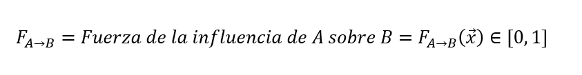
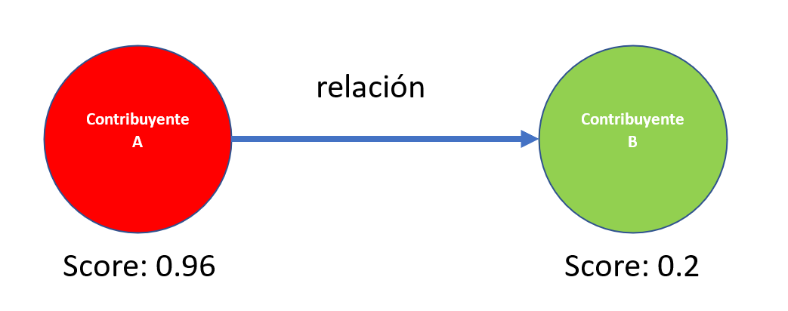
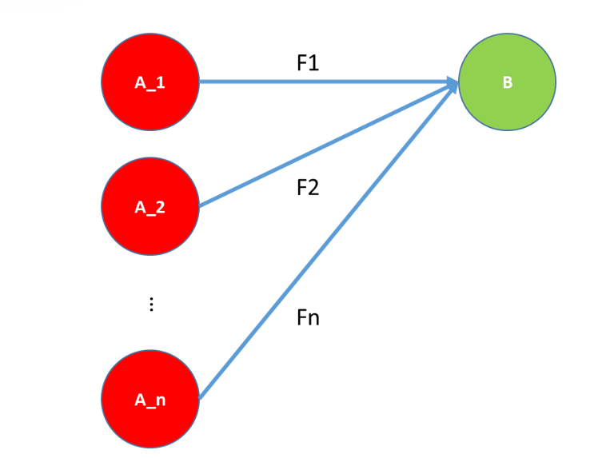
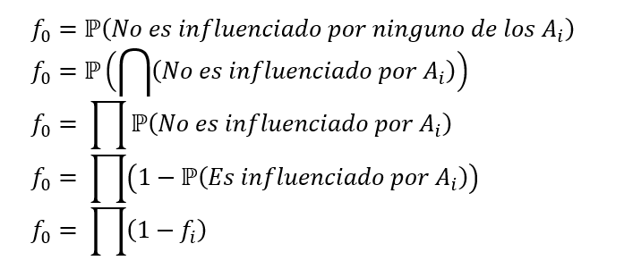
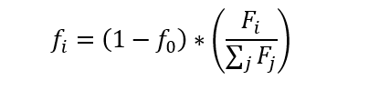
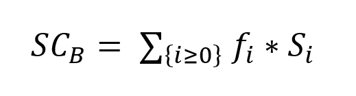

## Tabla de contenidos
1. [Informacion general](#informacion_general)
2. [Objetivo](#Objetivo)
3. [Colaboradores](#Colaboradores)
4. [Instalacion](#Instalacion)
5. [Tecnologias](#Tecnologias)
6. [Funcionamiento_algoritmo](#Funcionamiento_algoritmo)
7. [Ejecucion_propagacion](#Ejecucion_propagacion)
8. [Explicacion propagacion de contaminacion](#Explicacion_propagacion_contaminacion)
9. [Ejecucion_busqueda_comunidades_visualizacion](#Ejecucion_de_busqueda_de_comunidades_y_visualizacion_de_comunidades)
10. [Explicacion del proceso de busqueda de comunidades y visualizacion ](#Explicacion_del_proceso_de_busqueda_de_comunidades_y_visualizacion)
11. [Recursos_CML](#Recursos_CML)
12. [Sugerencias](#Sugerencias)
13. [Estructura_de _carpetas](#Estructura_de_carpetas)

## Informacion_general
***
Actualmente, se dispone de alertas tributarias lo cual permite establecer un índice de contaminación para entidades naturales y jurídicas. Esta contaminación se puede propagar por diferentes conexiones entre entidades debido a operaciones comerciales u otras. El propósito de este modelo será estudiar cómo se propaga dicha contaminación a otras entidades por medio de relaciones de tipo comercial bajo diferentes modelamientos de fuerzas de propagacion. De mismo modo se pretende crear visualizaciones de grafos que permitan establecer regularidades y comunidades con comportamiento comun. . 

## Objetivo
El objetivo es tener valores actualizados de contaminación para las entidades que ya tienen un cálculo de este valor y asignar un valor entre 0 y 1 para los demás entes relacionados comercialmente con cada una de las entidades anteriores. Este índice es cero cuando la entidad no representa una amenaza de ningún tipo y uno cuando es completamente propenso a generar un tipo de riesgo de fraude. Asimismo, se quiere analizar cuáles son los grupos más propensos a esta contaminación y visualizarlos con la herramientas de visualizacion de grafos *neo4j*.

## Colaboradores
***
En este proyecto participa Henry Vega, Data Analyst de APIUX asi como el equipo del Área de Riesgo e Informalidad del SII, compuesto por Daniel Cantillana, Jorge Bravo y Yasser Nanjari, además Arnol Garcia, jefe de área y Manuel Barrientos, con soporte técnico en el espacio de trabajo y Jorge Estéfane, jefe de proyecto por parte de APIUX.

## Instalacion
***
Los pasos para instalar el proyecto y ejecutarlo son: 
1. Instalar paquetes con el notebook 'install_packages.ipynb'
2. Ejecutar notebooks de Python en el orden indicado (puede ser tambien el job asociado si esta disponible esta funcionalidad)

## Tecnologias
***
Una lista de las tecnologias mas importantes utilizadas,tanto para manejo de dataets, graficos,algoritmos y otros.

- Pandas
- Pyspark
- Matplotlib
- Pyspark_dist_explore
- py2neo
- networkx
- cdlib 
- os

## Funcionamiento_algoritmo
Para poder realizar una propagacion de riesgo, consideraremos que éste se puede propagar debido a una influencia directa de un contribuyente sobre otro. Por ejemplo, al considerar una relación patrimonial o familiar, o debido a un impacto indirecto, como al considerar una relación comercial donde por ejemplo si una de las partes en la relación no cumple de forma correcta todas sus obligaciones tributarias podría afectar a que la otra parte no cumpla o cumpla parcialmente con las suyas, luego en este caso no hay un influencia directa en el comportamiento del contribuyente contaminado, sino que la contaminación se da de forma indirecta. 

En el caso de este algoritmo propuesto, se consideran dos tipos de fuerzas, una relacionada con el IVA de las transaciones, otra que toma en cuenta la fraccion de operaciones con representante contaminado y una fuerza que resulta del promedio de ambas. 

Junto con las fuerzas de relaciones, hay un valor de contaminacion que inicialmente es 0 o 1 para cada entidad (considerando que ya estaba contaminado en base a alguna alerta o no lo esta). La propagacion se ejecuta con estas condiciones iniciales un aserie de iteraciones donde se propaga esta contaminacion bajo ciertas reglas. Consideremos que para una entidad B, pueden haber muchas entidades A relacionadas, por lo cual el valor de actualizacion depende de todas las entidades *Ai* que tienen alguna conexion y generan documentos tributarios en *B*. 

Se define el factor de influencia como la probabilidad de que el contribuyente B sea afectado o influenciado por el contribuyente *Ai*, y donde *f0* lo asociamos a la probabilidad de que el contribuyente B no sea afectado o influenciado por ninguno de sus relacionados. Se puede calcular esta probabilidad como:

Y los valores *fi* se pueden definir como:

Finalmente, se puede definir el scoring de la entidad B como una ponderacion de los valores de scoring involucrados, ademas el valor solo se actualiza si el nuevo sore de contaminacion es mayore que el anterior. :

## Ejecucion_propagacion
***
Orden y explicación de los archivos que deben ser ejecutados en el siguiente orden para el correcto desempeño del proyecto:

1. `install_packages.ipynb`:contiene el script de instalacion de los diferentes packages de python que seran utilizados en los diferentes notebooks. 

2. `to_py.ipynb`:contiene el script de generacion de reporte  'reports/Resultados_propagacion.html' con resultados principales como de  transformacion de los notebooks de python a formato de script '.py' para ser ejecutados en los job asocioados. De ser asi, seria necesario ejecutar los jobs en el orden correcto para un resultados efectivo (mas detalles adelante).

2. `data_contaminados.ipynb`:  Contiene el código que permite obtener a partir de la tabla DW_TRN_REPRESENTANTES_EH obtener una base de datos de contaminados. Se incluyen todos los rut que presentan algun tipo de alerta relacionados con fraude. Este calculo es crucial para los pasos posteriores. 

3. `fuerza_contaminacion_iva.ipynb`: Contiene el código que permite obtener a partir de la tabla JBA_ARCOS_E una fuerza basada en el porcentaje de contribucion de IVA de esa entidad con respecto al total. La tabla ya posee informacion agregada para poder hacer esta operacion. El output de este notebook es  'data/processed/fuerza_iva.csv', el cual es un archivo csv que contiene los valores de fuerza para ser luego procesados por el algoritmo iterativo de propagacion.

4. `fuerza_contaminacion_representante.ipynb`: Contiene el código que permite obtener a partir de la tabla HEADER_DTE_CONSOLIDADA_ENC_SAS_ANALITICA, tabla de relaciones comerciales desagregada (formulario 33 y 34) el promedio de las proporciones de iva y de numero de transacciones con representante contaminado. A partir de ello, se obtiene una tabla de fuerza similar a la fuerza explicada anteriormente. El output de este notebook es 'data/processed/fuerza_representante.csv' que se utilizara para la propagacion. 

5. `propagacion_contaminacion_iva.ipynb`: contiene el codigo de propagacion de contaminacion para el caso de la fuerza contenida en el archivo 'data/processed/fuerza_iva.csv'. A partir de dicho archivo, se ejecuta la propagacion y se actualiza el valor de contaminacion de las distintas entidades relacionadas. Este notebook tiene como output el archivo 'data/processed/contaminados_processed_iva.csv', con los valores contaminados actualizados para cada entidad sin considerar los ya conocidos, y el archivo data/processed/contaminados_processed_iva_total.csv que contiene todos lo valores. 

6. `propagacion_contaminacion_representante.ipynb`: contiene el codigo de propagacion de contaminacion para el caso de la fuerza contenida en el archivo 'data/processed/fuerza_representante.csv'A partir de dicho archivo, se ejecuta la propagacion y se actualiza el valor de contaminacion de las distintas entidades relacionadas. Este notebook tiene como output el archivo 'data/processed/contaminados_processed_representante.csv', con los valores contaminados actualizados para cada entidad sin considerar los ya conocidos. 

7. `propagacion_contaminacion_iva_representante.ipynb`: contiene el codigo de propagacion de contaminacion para el caso de la fuerza contenida en el archivo 'data/processed/fuerza_iva.csv' y tambien el archivo 'data/processed/fuerza_representante.csv'. A partir de dicho archivo, se promedian las fuerzas obteniendo un nuevo valor que se utiliza en la propagacion y se actualiza el valor de contaminacion de las distintas entidades relacionadas. Este notebook tiene como output el archivo 'data/processed/contaminados_processed_iva_representante.csv', con los valores contaminados actualizados para cada entidad sin considerar los ya conocidos.

8. `propagacion_contaminacion_iva_representante.ipynb`: contiene el codigo de propagacion de contaminacion para el caso de la fuerza contenida en el archivo 'data/processed/fuerza_iva.csv' y tambien el archivo 'data/processed/fuerza_representante.csv'. A partir de dicho archivo, se promedian las fuerzas obteniendo un nuevo valor que se utiliza en la propagacion y se actualiza el valor de contaminacion de las distintas entidades relacionadas. Este notebook tiene como output el archivo 'data/processed/contaminados_processed_iva_representante.csv', con los valores contaminados actualizados para cada entidad sin considerar los ya conocidos.

8. `reports/Resultados_propagacion.ipynb`: notebook de python que contiene los principales resultados de cada uno de los procesos de propagacion y principales conclusiones para cada tipo de propagacion.

## Explicacion_modelo_propagacion
***
El modelo se implementa por medio de diferentes jos dependientes entre si, los modelos de propagacion 
dependen de las fuerzas calculadas. De este modo el job 'propagacion_contaminacion_iva' que hace referencia a la propagacion por medio de la fuerza de ponderacion de IVA depende del job 'fuerza_contaminacion_iva'.
Lo mismo ocurre con el job 'propagacion_contaminacion_representante' que depende del job 'fuerza_contaminacion_representante'. En cambio, el job que se hace cargo de la propagacion mediante el promedio de las dos fuerzas, 'propagacion_contaminacion_iva_representante' se ejecuta de modo independiente. Por otro lado esta la opcion de obtener la combinacion de ambas fuerzas por el codigo presente en 'scr/models/fuerza/combinacion_fuerzas.py'.

## Ejecucion de busqueda de comunidades y visualizacion de caracteristicas de grupos
***
Orden y explicación de los archivos que deben ser ejecutados los scripts para poder buscar comunidades y visualizarlas en neo4j:

1. `scr/models/visualizacion/agregar_labels_contaminados.ipynb`: contiene el script que permite agregar labels de distinta indole al archivo de contaminados obtenido de la propagacion de contaminacion basado en la fuerza de representantes e IVA. Esto es util para la caracterizacion de comunidades que se encontraran por el algoritmo de Louvain. 

2. `scr/algorithms/louvain.py`: contiene el script que tomar las relaciones de fuerza asociada y agrega al archivo de contaminados indicado anteriormente una columna con el numero de comunidad correspondiente a cada entidad. Este scrip esta regulado por el job *louvain_algorithm*. Para poder reutilizar este job para encontrar comunidades con otros hiperparametros (como la resolucion) se necesita nuevamente correr el script anterior  `scr/models/visualizacion/agregar_labels_contaminados.ipynb`.

3. `reports/resultado_algoritmo_louvain.ipynb`: contiene un analisis de los resultados principales de la performance del algoritmo de Louvain, que sirve para detectar comunidades. Se analizan los principales grupos ordenados por valore promedio de contaminacion.

4. `scr/models/visualizacion/upload_data.ipynb`: contiene el  codigo que permite cargar la data junto con sus labels y comunidades a una instancia de neo4j para su posterior visualizacion con neo4j desktop.

5. `scr/models/visualizacion/muestreo_for_graph.ipynb`: contiene el  codigo que permite obtener un muestreos de las relaciones comerciales y contribuyentes involucrados filtrando por comunidad para su visualizacion con neo4j y bloom. La carga de esta data se precisa en el documento  `Visualizacion de grafos con  neo4j y bloom`.

## Explicacion del proceso de busqueda de comunidades y visualizacion 

Luego de calculadas las tablas de fuerzas y contaminacion, se agrega diferentes valores adicionales a cada entidad con el fin de facilitar la caracterizacion de comunidades, esto es:

1.-Valor de contaminacion

2.-Cuanto ha pagado el contribuyente (código 89 del f29)

3.-Cuanto compra o vende el contribuyente (total neto de IVA)

4.-Informacion geografica del contribuyente.

5.-Edad del contribuyente (numero de documentos y edad en dias desde fecha de constitucion).

6.-Un valor que indique si el contribuyente presentaba originalmente una alerta que propaga contaminacion (contaminacion 1) o no.

Luego de ello es posible calcular comunidades a partir de la creacion de un grafo con nodos y relaciones y agrupra los nodos en comunidades mediante el algoritmo de Louvain, el cual maximiza la modularidad de la red. Este valor es una medida de la estructura de las redes o gráficos que mide la fuerza de la división de una red en módulos. De esta forma el archivo de oscuridad es actualizado y cada entidad se asigna a una comunidad, luego se puede caracterizar la composicion de cada comunidad.
Posterioremente los datos de relaciones y entidades  son agregados a una instancia de neo4j  donde pueden ser consultados externamente.

## Recursos_CML
***
Todo la teoria mencionada en la seccion anterior fue implementada en CML en notebooks de pyhton como en ejecutables '.py' utilizando SQL en Spark para poder hacer la consulta de las tablas, filtrado y los procesos ETL correspondientes. Tambien se implementaron jobs (algunos dependientes entre si) para poder  ejecutar el proceso de calculo de fuerza para cada caso y posteriormente calcular la propagacion de contaminacion, junto con los calculo del algoritmo de Louvain. 

Se utilizo Spark 3.2.3 y Python 3.9 para crear el codigo y las correspondientes consultas y procesamiento de tablas.

## Sugerencias
***
Este modelo de propagacion de contaminacion puede ser ampliado para otras definiciones de fuerzas entre entidades, y tambien para otros indicadores diferentes a la contaminacion. Mas aun, este modelo es una base para cualquier tipo de problema donde haya relaciones entre entidades y se intente propagar valores de algun tipo.

### Estructura de las carpetas del proyecto
A continuacion se presenta la ubicacion de cada archivo del proyecto.

proyecto/

├── data/

│   ├── external/

│   ├── interim/

│   └── processed/

│       ├── contaminados_processed_iva_representante_total_with_labels.csv

│       ├── contaminados_processed_iva_representante_total.csv

│       ├── contaminados_processed_iva_representante.csv

│       ├── contaminados_processed_iva_total_with_labels.csv

│       ├── contaminados_processed_iva_total.csv

│       ├── contaminados_processed_iva.csv

│       ├── contaminados_processed_representante.csv

│       ├── contaminados.csv

│       ├── fuerza_iva_representante.csv

│       ├── fuerza_iva.csv

│       ├── fuerza_representante.csv

│       └── muestra_visualizacion (muestra de data para visualizaicon con neo4j y bloom)

├── reports/

│   ├── resultado_algoritmo_louvain.ipynb

│   └── resultados_propagacion.ipynb

└── src/

│  ├── algorithms/ 
    
│  │   └── louvain.py
    
│  ├── models/
   
│  │   ├── fuerza/
   
│  │   │   ├── combinacion_fuerzas.py
   
│  │   │   ├── fuerza_contaminacion_iva.py
   
│  │   │   └── fuerza_contaminacion_representante.py
   
│  │   ├── propagacion/
   
│  │   │   ├── propagacion_contaminacion_iva_representante.py
   
│  │   │   ├── propagacion_contaminacion_iva.py
   
│  │   │   └── propagacion_contaminacion_representante.py
   
│  │   └── visualizacion/
   
│  │   │   ├── agregar_labels_contaminados.ipynb

│  │   │   ├── muestreo_for_graph.ipynb
   
│  │   │   └── upload_data.ipynb
   
│  └── notebooks/
   
│       ├── data_contaminados.ipynb
        
│       ├── fuerza_contaminacion_iva.ipynb
        
│       ├── fuerza_contaminacion_representante.ipynb
        
│       ├── propagacion_contaminacion_iva.ipynb
        
│       └── propagacion_contaminacion_representante.ipynb
